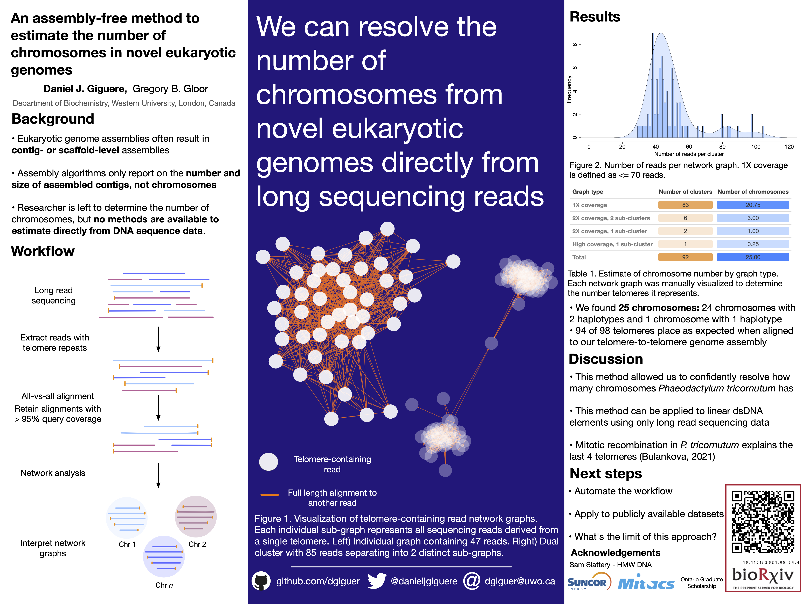

# Estimating chromosomes in eukaryotic genomes

Here is a poster I presented about this workflow Nov 2021 in London, Ontario.



Below is a general workflow from raw reads to network analysis using previously developed tools. 

Other software used: [seqtk](https://github.com/lh3/seqtk), [minimap2](https://github.com/lh3/minimap2), [iGraph](https://igraph.org/r/)

```
# filter to 50 kb minimum since this dataset's read N50 is around 35 kilobases. 
seqtk seq -L 50000 wt_pt-guppy-3-6.fastq.gz | gzip > wt_pt-guppy-3-6_50kb.fastq.gz

# extract all telomere-containing reads. 
gunzip -c wt_pt-guppy-3-6_50kb.fastq.gz | grep -A 2 -B 1 --no-group-separator -E "AACCCTAACCCTAACCCT|AGGGTTAGGGTTAGGGTT" - | gzip > 50kb_telomere_reads.fastq.gz

# align all reads against each other
minimap2 -x ava-ont -t 14 50kb_telomere_reads.fastq.gz 50kb_telomere_reads.fastq.gz > data/telo_50kb_overlaps.paf  

# retain only reads with 95% query coverage
awk '( ($4 - $3 ) / $2 ) >= 0.95 {print $0}' data/telo_50kb_overlaps.paf  > data/telo_50kb_overlaps_filt.paf 

# open R 
R

library(igraph)

d <- read.table("data/telo_50kb_overlaps_filt.paf")

subset <- data.frame(from=d$V1, to=d$V6)

g <- graph_from_data_frame(subset)

clu <- components(g)

# extract all network graphs with at least 10 reads in it
graphs <- decompose.graph(g, min.vertices=10)

# to recreate figure 1C:

# i = 5
i = 1 

plot(graphs[[i]], vertex.label=NA, vertex.size=15, edge.arrow.size=0.1, vertex.color=rgb(0.2,0,1, 0.2), vertex.frame.color="NA", main=paste0("Graph ", i))

q()#n
```

To recreate distribution of network graph sizes (Figure 1B)

```
# create figure 1B

final <- vector()

for (i in seq(length(groups(clu)))) {

    final[i] <- length(groups(clu)[[i]])
    
}

# plot the histogram of telomere cluster types 
# remove noise
final.sub <- final[which(final > 10)]

# adjust to 1.5 to show 3 clear peaks
den <- density(final.sub, adjust =1.5)

# normalize final.sub to get on same y- axis
final.plot <- final.sub / max(final.sub)

pdf("figs/chapter_3_reads_per_cluster.pdf")
hist(final.sub, breaks = 99, xlim = c(0, 120), xlab = "", xaxt="n", ylab = "Frequency", main = "", col = rgb(0,0,1,0.5), bty="n")
par(new=TRUE)
plot(den, ylab = "", xlab = "Number of reads per cluster", main = "", yaxt="n",xlim = c(0, 120), bty = "n")
polygon(den, col = rgb(1,0,1,0.3), border = "NA", xlim = c(0, 120), bty="n")
dev.off()
```
